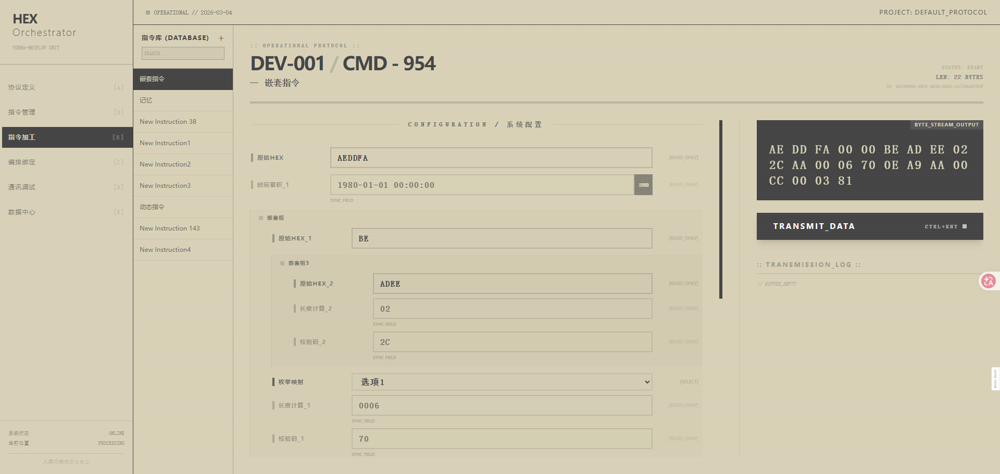
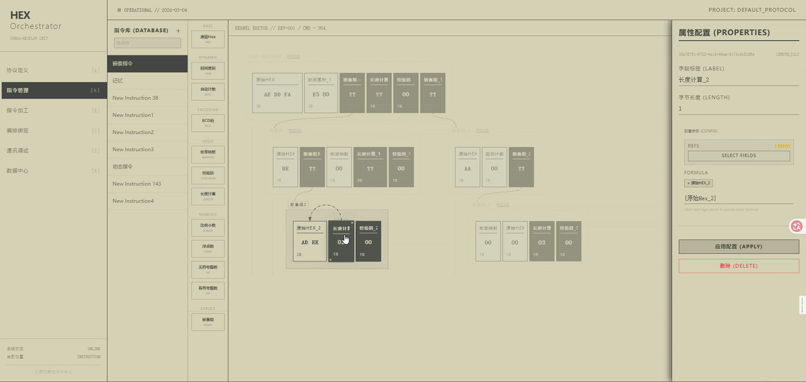
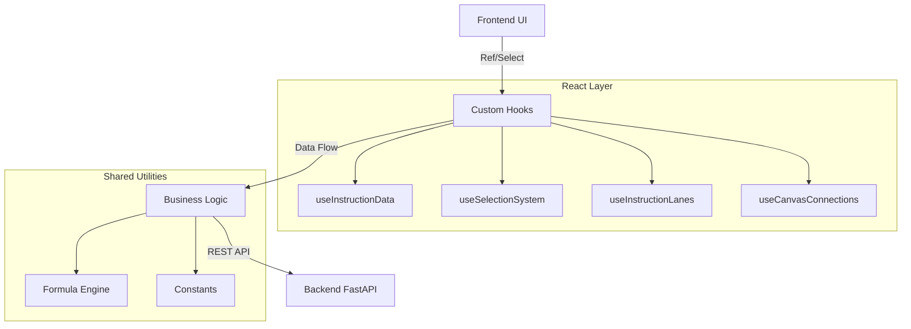

# YoRHa-HexFlow: Hex Instruction Orchestrator


**YoRHa-HexFlow** is a highly visual hexadecimal instruction orchestration tool designed to simplify complex low-level binary protocol design through a Block Flow approach. Its design is inspired by the UI style of *Nier: Automata*, emphasizing interaction fluidity and immersion.

<p align="center">
  
</p>

<p align="center">
  
</p>

## ✨ Key Features

### 1. Visual Orchestration
- **Drag & Drop Blocks**: Based on `@dnd-kit`, supporting infinite nested block dragging and sorting.
- **Dynamic Swimlanes**: Automatically generates hierarchical swimlane views based on data structure.
- **Smart Connections**: Automatically draws logical relationships between blocks (e.g., checksum references, length calculation references).

### 2. Powerful Logic Engine
- **Real-time Formula Calculation**: Supports dynamic formulas like `([FieldA] + 10) / 2`, with real-time preview of calculation results on the frontend.
- **Auto Counters & Time Accumulation**: Built-in intelligent blocks like `AUTO_COUNTER` and `TIME_ACCUMULATOR`.
- **Multi-base Support**: Property panels support seamless switching between HEX/DEC/BIN input.

### 3. Engineering & Quality
- **SRP Architecture**: Strictly follows the Single Responsibility Principle, with logic hooked and components atomized.
- **Full-link Testing**: 
  - Integrated `Vitest` + `React Testing Library`.
  - 100% test coverage for core hooks.
  - Includes smoke tests to prevent crashes.

## 📌 Current Page Status

Page navigation labels, placeholder descriptions, and implementation status now use `frontend/src/config/pageStatus.json` as the single source of truth.

- See the current page matrix in [docs/PAGE_STATUS.md](./docs/PAGE_STATUS.md)
- `Protocol Definition`, `Instruction Management`, `Instruction Processing`, and `Orchestration Binding` are connected to the current SQLite / FastAPI main flow.
- `Communication Terminal` and `Data Hub` are still placeholder pages, and the documentation now reflects that explicitly.

---

## 🚀 Quick Start

### 1. Database Setup
The project now defaults to the repository-local SQLite database at `backend/db/yorha.db`. Tables, operator templates, and sample instructions are created automatically on first startup.

```bash
# No external database service required
```

### 2. One-Click Startup
On Windows, use the root script to boot both backend and frontend.

```bash
.\start-dev.ps1
```

The script will:
- install missing Python dependencies for the backend
- install missing Node dependencies for the frontend
- start the FastAPI backend on `http://127.0.0.1:8000`
- start the Vite frontend on `http://127.0.0.1:5173` when available, otherwise another free port

### 3. Manual Startup
If you want to run each side separately:

```bash
# Backend
python -m pip install -r backend/requirements.txt
python -m uvicorn backend.main:app --reload

# Frontend
cd frontend
npm install
npm run dev
```

### 4. Run Tests
Ensures the safety and stability of code modifications.

```bash
cd frontend
npm run test
```

---

## 🏗️ Architecture



For detailed technical specifications, please refer to: [SPECIFICATION.md](./SPECIFICATION.md)

---

## 📜 Directory Structure

```
/backend
    /main.py            # FastAPI entry point
    /models.py          # Pydantic data models
    
/frontend
    /src
        /components     # Atomic UI components (Block, PropertiesPanel)
        /hooks          # Business logic Hooks (Data, Selection)
        /pages          # Page-level containers (Instruction, Canvas)
        /utils          # Pure function utilities (Formula, Hex)
        /constants.js   # Global constant definitions
    /src/hooks/__tests__ # Unit test suite
```

## ⚠️ Development Guidelines
1. **Single Responsibility**: No single file should exceed 400 lines; complex logic must be extracted into Hooks.
2. **Test-Driven**: `npm run test` must be run after modifying core logic.
3. **DRY Principle**: Avoid Magic Strings; use `constants.js`.

---
*Glory to Mankind.*
