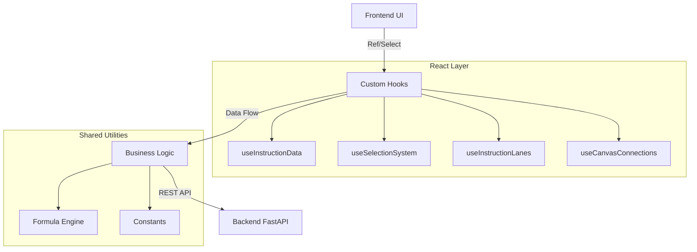

# YoRHa-HexFlow: Hex Instruction Orchestrator


**YoRHa-HexFlow** 是一个高度视觉化的 16 进制指令编制工具，旨在通过积木流 (Block Flow) 的方式简化复杂的底层二进制协议设计。其设计灵感来源于 *Nier: Automata* 的 UI 风格，强调交互的流畅性与沉浸感。

<p align="center">
  
</p>

<p align="center">
  
</p>

## ✨ 核心特性 (Key Features)

### 1. 可视化编排 (Visual Orchestration)
- **拖拽式积木 (Drag & Drop)**: 基于 `@dnd-kit`，支持无限层级嵌套的积木拖拽与排序。
- **动态泳道 (Swimlanes)**: 自动根据数据结构生成层级分明的泳道视图。
- **智能连线**: 自动绘制积木间的逻辑引用关系（如校验和引用、长度计算引用）。

### 2. 强大的逻辑引擎 (Logic Engine)
- **实时公式计算**: 支持 `([FieldA] + 10) / 2` 形式的动态公式，前端实时预览计算结果。
- **自动计数器 & 时间累计**: 内置 `AUTO_COUNTER` 和 `TIME_ACCUMULATOR` 等智能积木。
- **多进制支持**: 属性面板支持 HEX/DEC/BIN 无缝切换输入。

### 3. 工程化与质量 (Engineering)
- **SRP 架构**: 严格遵循单一职责原则，逻辑 Hook 化，组件原子化。
- **全链路测试**: 
  - 集成 `Vitest` + `React Testing Library`。
  - 核心 Hooks 测试覆盖率 100%。
  - 包含防崩溃的冒烟测试 (Smoke Tests)。

---

## 🚀 快速启动 (Quick Start)

### 1. 数据库初始化 (Database)
项目默认使用仓库内的 SQLite 数据库 `backend/db/yorha.db`，首次启动会自动建表并补充算子模板与示例指令数据。

```bash
# 无需额外数据库服务
# 首次启动后会自动生成/更新 backend/db/yorha.db
```

### 2. 一键启动 (Recommended)
Windows 下可直接使用根目录脚本同时拉起前后端。

```bash
# 双击 start-dev.bat
# 或在 PowerShell 中执行
.\start-dev.ps1
```

脚本会自动：
- 检查并安装后端 Python 依赖
- 检查并安装前端 Node 依赖
- 启动 FastAPI 后端 (`http://127.0.0.1:8000`)
- 启动 Vite 前端（优先 `http://127.0.0.1:5173`，被占用时自动换端口）

### 3. 手动启动 (Advanced)
如需分别启动，可按下面方式运行。

```bash
# Backend
python -m pip install -r backend/requirements.txt
python -m uvicorn backend.main:app --reload

# Frontend
cd frontend
npm install
npm run dev
```

### 4. 运行测试 (Run Tests) [NEW]
确保代码修改的安全性与稳定性。

```bash
cd frontend
npm run test
```

---

## 🏗️ 项目架构 (Architecture)



详细技术规格请参考: [SPECIFICATION.md](./SPECIFICATION.md)

---

## 📜 目录结构

```
/backend
    /main.py            # FastAPI 入口
    /models.py          # Pydantic 数据模型
    
/frontend
    /src
        /components     # 原子 UI 组件 (Block, PropertiesPanel)
        /hooks          # 业务逻辑 Hooks (Data, Selection)
        /pages          # 页面级容器 (Instruction, Canvas)
        /utils          # 纯函数工具 (Formula, Hex)
        /constants.js   # 全局常量定义
    /src/hooks/__tests__ # 单元测试套件
```

## ⚠️ 开发规范 (Guidelines)
1. **单一职责**: 单文件不超过 400 行，复杂逻辑必须提取 Hook。
2. **测试驱动**: 修改核心逻辑后必须运行 `npm run test`。
3. **DRY 原则**: 避免 Magic Strings，使用 `constants.js`。

---
*Glory to Mankind.*
